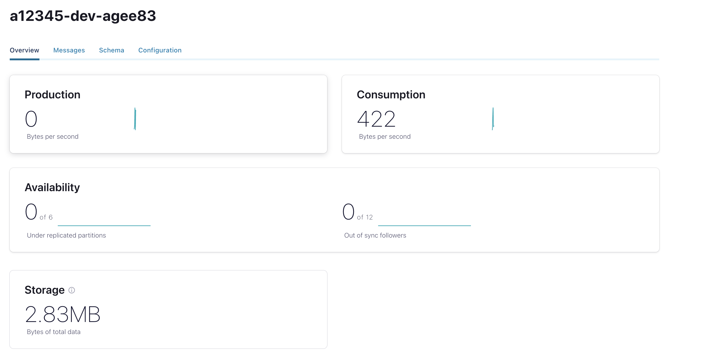
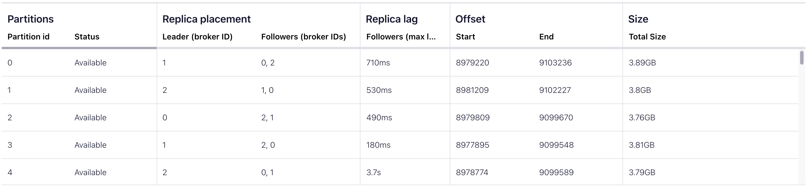
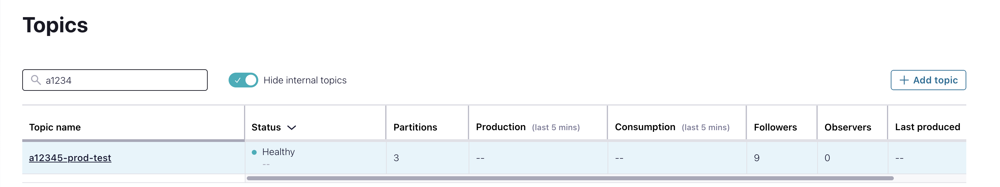

## Monitoring Option available for customer

### Control Center 
Control center is a web-based application allows users to monitor Kafka system in predefined dashboards.

->Login to Control Center -> Click on Cluster

1. Click Topic to monitor the topic health and other metrics like produce/consume bytes, storage, replica lag etc
    

   produce/consume bytes, storage
    

   replica lag
    

3. Click Consumers to view the Consumer lag for group



## Java client API

One of the key metric for a consumer is consumer lag i.e delta between the consumer's last committed offset and the producer's end offset in the log. Developers can use to query some key metrics like consumer lag, topic configuration etc. Below git page has the sample Java API example how to retrieve consumer lag.

    https://github.com/gwenshap/kafka-examples/blob/master/AdminClientExample/src/main/java/org/example/AdminClientExample.java 

### code snippet

````java
    // Get offsets committed by the group
    Map<TopicPartition, OffsetAndMetadata> offsets =
    admin.listConsumerGroupOffsets(CONSUMER_GROUP)
    .partitionsToOffsetAndMetadata().get();
    
    Map<TopicPartition, OffsetSpec> requestLatestOffsets = new HashMap<>();
    Map<TopicPartition, OffsetSpec> requestEarliestOffsets = new HashMap<>();
    Map<TopicPartition, OffsetSpec> requestOlderOffsets = new HashMap<>();
    DateTime resetTo = new DateTime().minusHours(2);
    
    // For all topics and partitions that have offsets committed by the group, get their latest offsets, earliest offsets
    // and the offset for 2h ago. Note that I'm populating the request for 2h old offsets, but not using them.
    // You can swap the use of "Earliest" in the `alterConsumerGroupOffset` example with the offsets from 2h ago
    for(TopicPartition tp: offsets.keySet()) {
    requestLatestOffsets.put(tp, OffsetSpec.latest());
    requestEarliestOffsets.put(tp, OffsetSpec.earliest());
    requestOlderOffsets.put(tp, OffsetSpec.forTimestamp(resetTo.getMillis()));
    }
    
    Map<TopicPartition, ListOffsetsResult.ListOffsetsResultInfo> latestOffsets =
    admin.listOffsets(requestLatestOffsets).all().get();
    
    for (Map.Entry<TopicPartition, OffsetAndMetadata> e: offsets.entrySet()) {
    String topic = e.getKey().topic();
    int partition = e.getKey().partition();
    long committedOffset = e.getValue().offset();
    long latestOffset = latestOffsets.get(e.getKey()).offset();
    
        System.out.println("Consumer group " + CONSUMER_GROUP
        + " has committed offset " + committedOffset
        + " to topic " + topic + " partition " + partition
        + ". The latest offset in the partition is "
        + latestOffset + " so consumer group is "
        + (latestOffset - committedOffset) + " records behind");
    }

````

Sample Output from the Java client:


    Consumer group a12345-devk-test-consumer1 has committed offset 2 to topic a12345-dev-gcpaviatrixazkafka partition 2. The latest offset in the partition is 2 so consumer group is 0 records behind
    Consumer group a12345-devk-test-consumer1 has committed offset 1 to topic a12345-dev-gcpaviatrixazkafka partition 0. The latest offset in the partition is 1 so consumer group is 0 records behind
    Consumer group a12345-devk-test-consumer1 has committed offset 1 to topic a12345-dev-gcpaviatrixazkafka partition 1. The latest offset in the partition is 1 so consumer group is 0 records behind
    Consumer group a12345-devk-test-consumer1 has committed offset 2108141 to topic a12345-dev-test partition 1. The latest offset in the partition is 2108141 so consumer group is 0 records behind
    Consumer group a12345-devk-test-consumer1 has committed offset 2096427 to topic a12345-dev-test partition 2. The latest offset in the partition is 2096427 so consumer group is 0 records behind
    Consumer group a12345-devk-test-consumer1 has committed offset 2108944 to topic a12345-dev-test partition 0. The latest offset in the partition is 2108944 so consumer group is 0 records behind


[Ref Blog](https://www.baeldung.com/java-kafka-consumer-lag)

## Kafka CLI

Kafka command line interface helps both developer and administrators to interaction with Apache Kafka. Below are some command that a developer will be interested to manage and monitor the topics

### Create Topics

````shell
bin/kafka-topics.sh --bootstrap-server kafka.pp01.kafka.ford.com:443 \
--command-config=<config.properties> \
--topic <topic-name> \
--create --replication-factor 3 --partitions 6
````

### Describe a topic
````shell
bin/kafka-topics.sh --bootstrap-server kafka.pp01.kafka.ford.com:443 \
--command-config=<config.properties> \
--topic <topic-name> \
--describe
````
### Unavailable partition (offline partition)
```shell
bin/kafka-topics.sh --bootstrap-server kafka.pp01.kafka.ford.com:443 \
--unavailable-partitions --describe \
--command-config=<config.properties>
```

### Under replication partition
````shell
bin/kafka-topics.sh --bootstrap-server kafka.pp01.kafka.ford.com:443 \
--under-replicated-partitions --describe \
--command-config config/kafka-client-admin.properties
````


### Consumer from a topic
````shell
bin/kafka-console-consumer.sh --bootstrap-server kafka.pp01.kafka.ford.com:443 \
--consumer.config=<config.properties> --topic <topic-name> \
--group <consumer-group>
````
### Consumer Lag

````shell
bin/kafka-consumer-groups.sh --bootstrap-server kafka.pp01.kafka.ford.com:443 \
--command-config=<config.properties> \
--group <consumer-group> --describe
````

Sample Result:

    GROUP                          TOPIC                     PARTITION  CURRENT-OFFSET  LOG-END-OFFSET  LAG             CONSUMER-ID                                      HOST            CLIENT-ID
    a12345-dev-test-group a12345-dev-test 2          10              10              0               consumer-13-b6135eda-ac10-4269-88c3-41abcc547f56 /172.24.6.20    consumer-13
    a12345-dev-test-group a12345-dev-test 1          11              11              0               consumer-13-b198375a-3255-4fb7-937c-2ba62244798e /172.24.6.20    consumer-13
    a12345-dev-test-group a12345-dev-test 0          9               9               0               consumer-13-6950b83c-cb39-4486-94c2-55aca1942bf9 /172.24.8.7     consumer-13

Query will provide partition level consumer offset and lag details for each consumer in the consumer group

