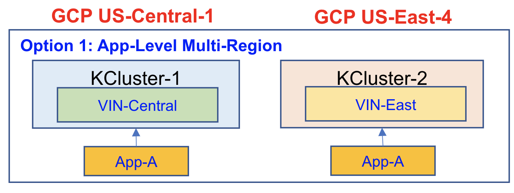
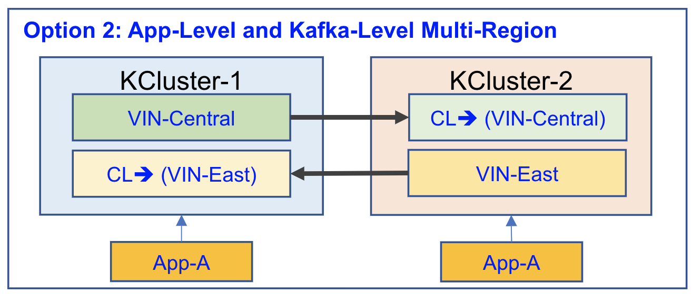
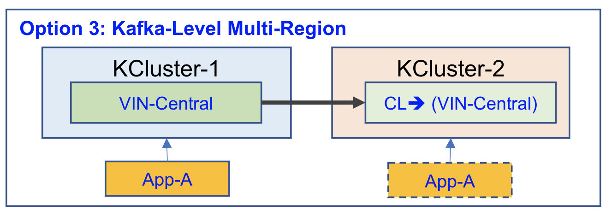
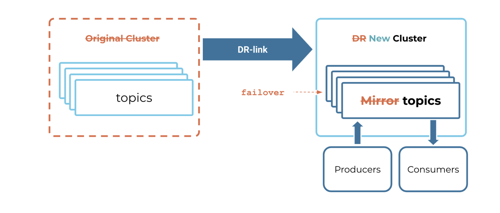

# Multi Region Testing

## Step 1: Onboarding application to East cluster.

As a Pre-requisite for a multi region testing application team needs to be onboarded to US East 4 confluent kafka cluster. Onboarding steps may vary based on which of option is selected for multi region enablement. 

We have three option available for enabling the multi region. Please refer the slide 10 on the below document which cover the options in detail

[Confluent Kafka Platform Multi-Region Solution and Application Design](https://azureford.sharepoint.com/sites/CloudPlatform_Data_Service/Engineering%20Documents/Kafka/Kafka%20Service%20v4-2022-Customer.pdf)


### Option 1: App-Level Multi-Region **(Partial Outage? / Partial Data Inaccessible)**

    • Manual recovery – no failover(partial outage acceptable)
    • Use two Kafka Topics in two different Kafka Clusters in US Central1 and US East4.
    • Data stays in respective region (not available on the other region)
    • Application run (produce and consume) in both regions.
    • If one region fails:
        • App in the other region continues to work (partial outage?)
        • Failed region wait for recovery of the service.


        
### Option 2: App-Level and Kafka-Level Multi-Region (Partial Outage?)

    • Manual failover and recovery
    • Use two Kafka Topics in two different Kafka Clusters in US Central1 and US East4.
    • Data is replicated to other region using Kafka Cluster Linking feature, target copy is read-only.
    • Application run (produce and consume) in both regions.
    • If one region fails:
        • App in the other region continues to work (partial outage?)
        • In Failed region: choose one of below options:
            • Wait for recovery of the service in failed region.
            • In other region promote read-only copy to read-write to process unprocessed data. This requires rebuild Kafka topic after the failed region comeback.



### Option 3: Kafka-Level Multi-Region (Outage)

    • Manual failover and recovery
    • Use one Kafka Topics for US Central1
    • Data replicated to other region using Kafka Cluster Linking feature, target copy is read-only.
    • Application run (produce and consume) in one region.
    • If one region fails:
        • In Failed region: choose one of below options:
            • Wait for recovery of the service in failed region.
            • In other region promote read-only copy to read-write to process. This requires rebuild Kafka topic after the failed region comeback.
            • Start the application on the other region.



## Step 2: Create US Central -> US East cluster link

Create a cluster link from the primary cluster(US Central) to the DR cluster(US East). Kafka service team will enable the cluster linking between the region and the link will be established per application topics


Cluster link will mirror following 
1. Topic and Configuration related to topic
2. Consumer group

Cluster-linking does not have the ability to sync role binding's to the destination cluster. There is an internal request with confluent team (FF-5801) which will be release part of future release.(no ETA)

### Step 3: Monitoring a Disaster Recovery Cluster (Kafka service team)

The clusters across region needs to stay up-to-date with the primary cluster, so we can minimize data loss when a disaster hits the primary cluster. Because Cluster Linking is an “asynchronous” process, there may be “lag”, messages that exist on the primary cluster but haven’t yet been mirrored to the DR cluster. Lagged data is at risk of being lost when a disaster strikes.

There are a multiple way to monitor the lag between Primary and the DR cluster like using cli or jmx metric. As we already have a monitor based on jmx we will include this metrics to our alerting in grafana
```shell
kafka_server_link_clusterlinkfetchermanager_value{name='MaxLag',service='kafka'}
```


## Step 4: FAILOVER - something goes wrong with cluster in US Central region

As we cannot replicate a failure scenario to either bring down a region or kafka cluster in that region, we can replicate the scenario by either of the below option

1. Delete the topic in the primary region.
2. Remove the application access to publish/consume

Following steps are needed from service team and application team to failover to US East cluster

1. Application team to stop producing and consuming to the topics in US central kafka cluster.
2. Kafka service team perform a dry run of a failover to preview the results without actually executing the command. To do this, simply add the --dry-run flag to the end of the command.
3. Kafka service team will promote the topics in the US East cluster from mirror topic to regular topic. 

> **_NOTE:_** Once you change your mirror topic to a regular topic, you cannot change it back to a mirror topic. If you want it to be a mirror topic once again, you will need to delete it and recreate it as a mirror topic.

4. Application team needs to update their producer or consumer configuration with the US East Kafka Bootstrap server.(kafka.pp31.kafka.ford.com:443)
5. Start the client application to start producing or consuming messages to/from US East Kafka cluster.

> **_CURRENT STATE:_** - there are 0 mirrored topics i.e there are no active cluster linking between US Central and US East.

6. Once the US Central region is back online, delete all the topic on US central kafka cluster
7. Create ClusterLink from US East Kafka -> US Central Kafka



## FAILBACK - In case application want to failback to US Central

We need to follow the steps in order to maintain there are no data loss during this changes

1. Kafka service team will monitor for zero lag on mirror topic and make sure all the data are synced to topic on west cluster.
2. Stop the Application clients which are producing/consuming data to/from US East kafka cluster.
3. Kafka service team will delete the cluster linking from US East to US Central kafka
4. Kafka service team will Promote the topics in US Central Kafka to regular topic
5. Application team to update the Producing and consuming client's configuration to point to US Central kafka bootstrap server and start the clients

## Restore the DR link
1. Kafka service team will restore original DR mirror by deleting the topic in US East and enabling the link back from US Central -> US East as mentioned in the start of the document

 [Refer](https://docs.confluent.io/cloud/current/multi-cloud/cluster-linking/dr-failover.html)