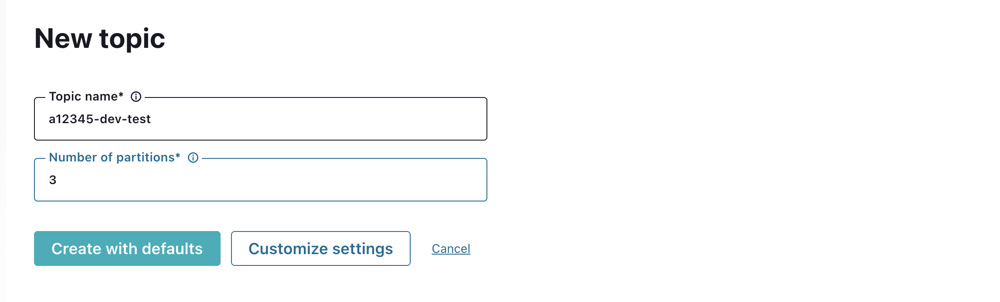

# Overview:

This document brief on  steps to connect to GCP confluent kafka. You can check your access using kafka CLI or via control center. Below are some basic cli command that can be used to create, describe and consume from topic. 

## Accessing kafka using CLI

### Prerequisite 
1. Create JKS truststore using Ford CA files (ford_ca.pem) using below command. Run this command for Ford CA file which you received in email.

```shell
keytool -import -trustcacerts -alias ford-ca -file <ford_ca.pem> -keystore truststore.jks -deststorepass <your_truststore_pass> -deststoretype pkcs12 -noprompt 
```
    
2. Create a property config file with below sample 
   1. Sample JaaS Configuration file: kafka-client-config-sample_unix.properties
```properties
      bootstrap.servers=<kafka-bootstrap-url:443>
      sasl.mechanism=PLAIN
      security.protocol=SASL_SSL
      sasl.jaas.config=org.apache.kafka.common.security.plain.PlainLoginModule required \
      username="<cds_id>" \
      password="<your_password>";
      ssl.truststore.location=<location of JKS trustore self_ford_truststore.jks>
      ssl.truststore.password=<JKS truststore password>
```


   2. Sample JaaS Configuration file: kafka-client-config-sample_windows.properties
```properties
   bootstrap.servers=kafka.pp01.kafka.ford.com:443
   sasl.mechanism=PLAIN
   security.protocol=SASL_SSL
   sasl.jaas.config=org.apache.kafka.common.security.plain.PlainLoginModule required \
   username="<CDSID>" \
   password="<CDSID-PASSWORD>";
   ssl.truststore.location=<location of JKS trustore self_ford_truststore.jks>
   ssl.truststore.password=<truststore_password>
```

### Create Topics

````shell
bin/kafka-topics.sh --bootstrap-server <kafka-bootstrap-server:443> \
--command-config=<config.properties> \
--topic <topic-name> \
--create --replication-factor 3 --partitions 6
````

### Describe a topic
````shell
bin/kafka-topics.sh --bootstrap-server <kafka-bootstrap-server:443> \
--command-config=<config.properties> \
--topic <topic-name> \
--describe
````

### Produce record to a topic
````shell
bin/kafka-console-producer.sh --bootstrap-server <kafka-bootstrap-server:443> \
--producer.config=<config.properties> \
--topic <topic-name>
````

### Consumer from a topic
````shell
bin/kafka-console-consumer.sh --bootstrap-server <kafka-bootstrap-server:443> \
--consumer.config=<config.properties> --topic <topic-name> \
--group <consumer-group>
--from-beginning
````

## Accessing kafka using Control center


### Create topic using control center

1. Login into control center(web UI) from browser (controlcenter.pp01.kafka.ford.com)
2. Application team can login into the webUI using their CDSID (which is part of onboarded FIM group)
3. Navigate to Topics --> Add topic

3. Provide the topic name and input number of parititon and click create with defaults


### Recommendations

1. Replication factor must be 3. Less than 3 will result in reduced or no SLA; cannot be greater than 3.
2. Default data retention is 7 days if data need to be stored for more than 7 days please keep in touch with kafka service team.
