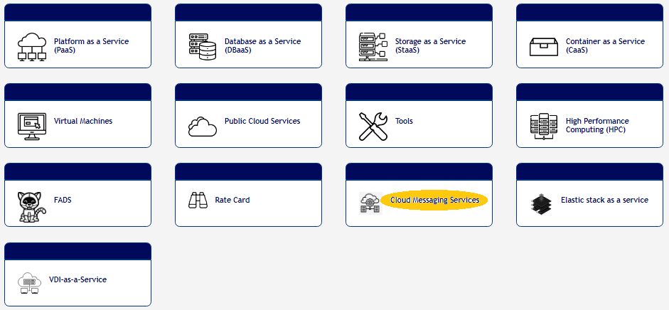
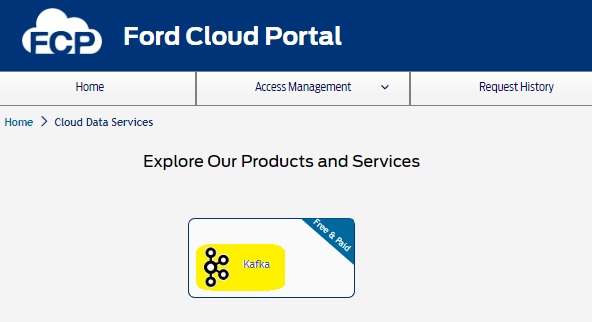
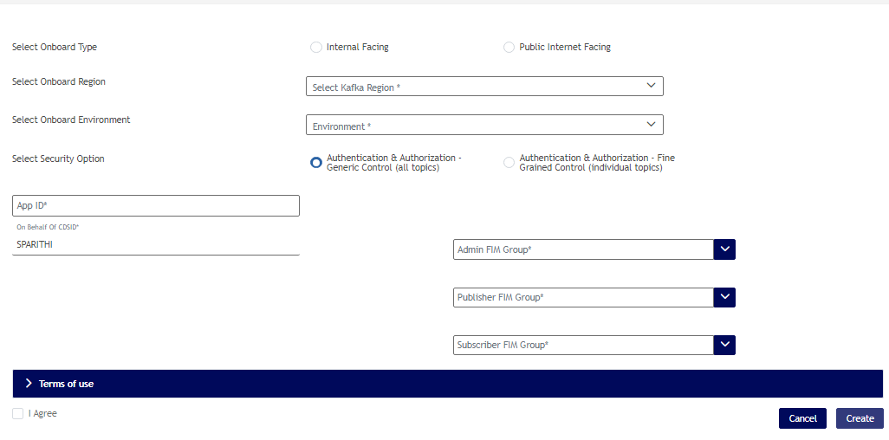
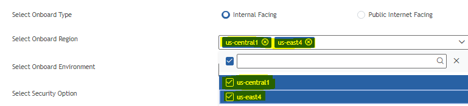
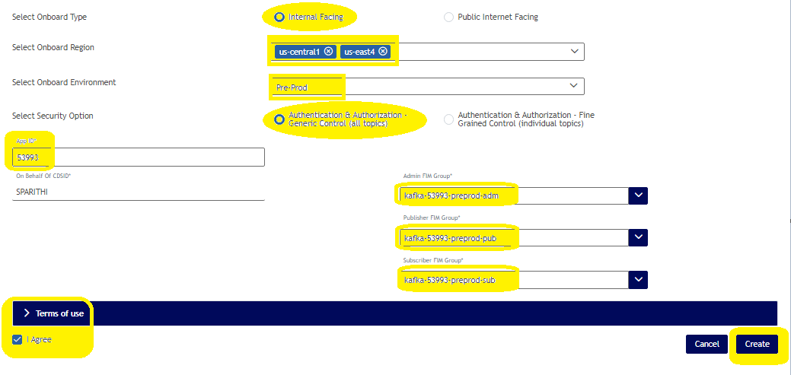
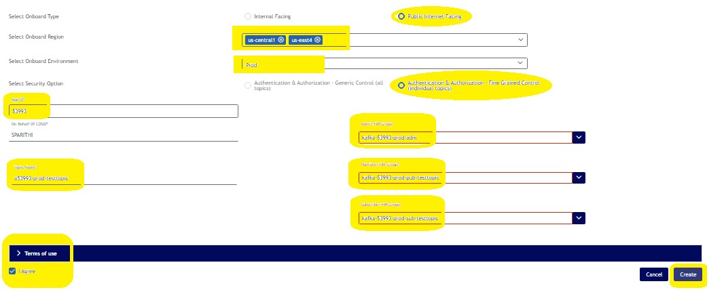
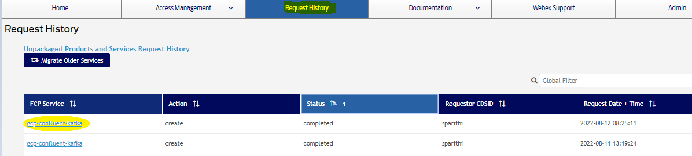
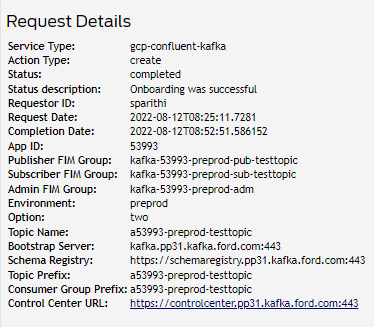

# Kafka-onboarding-using-Ford Cloud Portal


## Onboarding is now available for both Internal Facing and Public Internet facing clusters through Ford Cloud Portal
## Also users could now perform a multi-region onboarding at same time. i.e "US-Central" and "US-East" onboarding at same time with a single request using Ford Cloud Portal.

# Important note:
**1. Please do not make duplicate onboardings from the Ford Cloud Portal by creating the same requests multiple time, which will result in the onboarding failure.** 

**2. Once you create a request from FCP portal it would take 1-2 hours to complete the onboarding. Please wait for an onboarding successful or failure email confirmation.** 

**3. If the onboarding is successful, you will receive an email with successful confirmation and connection details.**
 
**4. If the onboarding is failed, you will receive an email stating the reason for failure. You could rectify the incorrect onboarding details and make a new request.**
  
**5. If you would require any help, please contact us in our "Kafka-PubSub-Community-Support" webex channel using this self join link https://www.webexteams.ford.com/space?r=bvgq**


## Please follow the below instructions to onboard onto Kafka

> **_NOTE:_**  
````
1. Onboarding through FCP portal is available for customers who wants to onboard their application on Kafka cluster running on (Internal facing) "US-Central1" and "US-East4" region or (Public Internet facing) "US-Central1" and "US-East4" region [Used for external customers].

2. For multi-region onboarding, please select both us-central1 and us-east4 regions and create a request.

````

### Pre Requisite
[Onboarding_Pre-requisite](./image/Onboarding_Pre-requisite.md)
### 1.	Open the Ford Cloud portal using the below link.

[Ford Cloud portal](https://www.cloudportal.ford.com/message-queue)

### 2.	Click on "Cloud Messaging Services".


### 3.	Click on "Kafka".


### 4.	Click on "Paid"..
 

### 5.	Enter the required details.



 a. Select an onboarding type.

     1. Internal Facing - Topic hosted on this cluster is only accessible within ford network
     2. Public Internet Facing - Only, topic that are used by external applications needs to be hosted on this cluster.

 b. Select an onboarding region from one of the below option. If you want to onboard onto both the regions, select both the regions checkbox.

     1. us-central1 
     2. us-east4

 c. Select onboard environment from one of the below option.

     1. Pre-Prod
     2. Prod
***Pre-prod environment is not available for external facing cluster*** .  

 d. Select security option. 

     1. Authentication & Authorization - Generic Control (all topics)
     2. Authentication & Authorization - Fine Grained Control (individual topics)

 #### 1.  "Authentication & Authorization - Generic Control (all topics)"

     Security group will have a wider permission for managing, publishing and consuming from topic. i.e access will be provided on prefix based i.e the security group will have access to all topic prefixed with a<APPID>-<ENV>

     kafka-AppID-env-adm <== Developer-Manage
     kafka-AppID-env-pub <== Developer-Write
     kafka-AppID-env-sub <== Developer-Read

| Form fields   | Tool tip      |  Mandatory/Optional | Example |
| ------------- | ------------- | ------------- | ------------- |
| Requester CDSID | CDSID of the person who requested the topic access  | Mandatory |
| App ID | Application EAMS App ID  | Mandatory | **53933** |
| Admin FIM Group | The name of the Security Group that should be given manage privilege for topic.Naming standard to be followed - **kafka- AppID-env-adm** | Mandatory | **kafka-53993-preprod-adm** |
| Publisher FIM Group | The name of the Security Group that should be given write privilege for topic. Naming standard to be followed - **kafka- AppID-env-pub** | Mandatory | **kafka-53993-preprod-pub** |
| Subscriber FIM Group | The name of the Security Group that should be given read privilege for topic. Naming standard to be followed - **kafka-AppID-env-sub** | Mandatory | **kafka-53993-preprod-sub** |
| Environment | The env should be given as prepod, prod | Mandatory | **preprod** |

### Please refer to the below sample provision screenshot.


##### *If you would need to do multi-region onboarding, select both the regions checkboxes. If not, click on the desired region you would need to onboard and fill the other required details.*


#### 2. "Authentication & Authorization - Fine Grained Control (individual topics)"


      Fine grain access request where topic authorization is provided for a specific topic. This option control access at topic level so each topic will have a specific security groups that control publisher and consumers

      kafka-AppID-env-adm <== Developer-Manage
      For each topic name:
      kafka-AppID-env-pub-topicname <== Developer-Write
      kafka-AppID-env-sub-topicname <== Developer-Read 
      

| Form fields   | Tool tip      |  Mandatory/Optional | Example |
| ------------- | ------------- | ------------- | ------------- |
| Requester CDSID | CDSID of the person who requested the topic access  | Mandatory |
| App ID | Application EAMS App ID  | Mandatory | **53933** |
| Admin FIM Group | The name of the Security Group that should be given manage privilege for topic.Naming standard to be followed - **kafka- AppID-env-adm** | Mandatory | **kafka-53993-preprod-adm** |
| Publisher FIM Group | The name of the Security Group that should be given write privilege for topic. Naming standard to be followed - **kafka-AppID-env-pub-topicname** | Mandatory | **kafka-53993-preprod-pub-testtopic** |
| Subscriber FIM Group | The name of the Security Group that should be given read privilege for topic. Naming standard to be followed -  **kafka-AppID-env-sub-topicname** | Mandatory | **kafka-53993-preprod-sub-testtopic** |
| Topic name | If you select an onboarding option as an "Authentication & Authorization - Fine Grained Control (individual topics)", enter the Topic-Name in the following format starting with an alphabet **"a"**. **[a(appid)-environment-topicname]**  | Mandatory | **a53993-preprod-testtopic** |
| Environment | The env should be given as prepod, prod | Mandatory | **preprod** |

### Please refer to the below sample provision screenshot. 
 


e. Click on "Terms of use" and "I Agree" and create.

#### Once the onboarding is completed, you will be notified through an e-mail about the onboarding status.


#### You could also view the onboarded history and details on the "Request History" tab of the Ford Cloud Portal.

## Request History
 

## Onboarded Details



