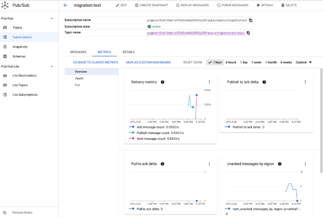

# Pub/SubMigration to GCP Provisioner 2.0

## Overview

Ford GCP environment will be migrating to version 2.0. New Projects on-boarded after June 2022 are now using GCP Provisioner 2.0. Projects that have been built from GCP Provisioner 1.0 will have to migrate to 2.0.

Migration will require the Application Teams to create a new V2.0 project.

Next, provision a new Pub/Sub Infrastructure in V2.0 project that matches their V1.0 Pub/Sub Infrastructure.

Finally, change the publishing and subscribing end point to new topics/subscription in V2.0 and validate.

The following Sections address these steps.

### Section 1: Project Creation using GCP Provisioner 2.0
#### Create a GCP Project using Provisioner 2.0 through FCP.

To create a new project in FCP, follow the [Self-Migration instructions.](https://docs.gcp.ford.com/docs/support/migration/self-migration/)


#### How To : GCP Service Account Creation and Usage
https://azureford.sharepoint.com/:w:/r/sites/cloud/_layouts/15/Doc.aspx?sourcedoc=%7B227A057B-337D-4BDF-B88F-219601A14090%7D&file=How%20To%20-%20GCP%20Service%20Account%20Creation%20and%20Usage.docx&wdLOR=c38AB4B73-1C80-EE48-BBD6-C74DB49B41DC&action=default&mobileredirect=true

#### GCP Self Service
| Method                                                | Links                                                                                                                                                                                                                                                       |
|-------------------------------------------------------|-------------------------------------------------------------------------------------------------------------------------------------------------------------------------------------------------------------------------------------------------------------|
| Ford Cloud Portal                                     | https://www.cloudportal.ford.com/gcp                                                                                                                                                                                                                        |
| Take GCP Degreed training for Terraform and Tekton	   | [GCP Degreed Training](https://degreed.com/pathway/08g25yrl8w?path=google-cloud-platform--gcp--onboarding)                                                                                                                                                  
| Perform GCP Checklist Tasks                           | [GCP Checklist](https://azureford.sharepoint.com/sites/cloud_integration/CI%20public%20docs/Helpful%20guides/GCP%20Onboarding%20Checklist%202.0.xlsx?web=1)                                                                                                 
|                                                       | ITO Tekton Pipeline for Terraform Repo                                                                                                                                                                                                                      |
| Service Readiness Dashboard                           | [Link to available Terraform Modules, Service Owners & FCP Status](https://fileregistry-64yy6osora-uc.a.run.app/artifacts/gcp_service_json/ServiceReadinessStatus.html)                                                                                     | 
| Create Service Account and IAM Bindings via Terraform | [How To - GCP Service Account Creation and Usage](https://azureford.sharepoint.com/:w:/r/sites/cloud/Training%20and%20Support/How%20To%20-%20GCP%20Service%20Account%20Creation%20and%20Usage.docx?d=w227a057b337d4bdfb88f219601a14090&csf=1&web=1&e=bBFSbG) |
| Create IAM Bindings via Terraform                     | [GCP How To - Give Permissions](https://azureford.sharepoint.com/:w:/r/sites/cloud/Training%20and%20Support/GCP%20How%20To%20-%20Give%20Permissions.docx?d=w9cab20e390ff4912aebbfe74b7417c55&csf=1&web=1&e=Q7KdOJ)                                          |
| ITO GCP Learning Hub                                  | [ITO GCP Learning Site](https://azureford.sharepoint.com/sites/itoinfraservices/SitePages/GCP-Learning.aspx)                                                                                                                                                |
| Available ITO GCP architecture documents              | [Guide to the Ford GCP Environment](https://azureford.sharepoint.com/:w:/r/sites/cloud/Training%20and%20Support/Guide%20to%20the%20Ford%20GCP%20Environment.docx?d=w49d67b02478a4e11a78056435dd166c7&csf=1&web=1&e=tgIPVd)                                  | 
|                                                       | [Ford GCP Technical Infrastructure Design](https://azureford.sharepoint.com/:b:/r/sites/cloud/Training%20and%20Support/Ford%20Technical%20Infrastructure%20Design%20Doc.pdf?csf=1&web=1&e=FXTb3e)                                                                        |                                                                                                                                                                                                                                                              
|                                                       | [GCP Services Decision Point Guide](https://azureford.sharepoint.com/:w:/r/sites/cloud/Training%20and%20Support/GCP%20Services%20Decision%20Point%20Guide%20For%20Architects-6.0.docx?d=w29c4c45960fb4b70a9546b3ea04cf609&csf=1&web=1&e=eoWm1L)                                                                                                                                                                                                        |
|                                                       | [GCP Service HA/DR](https://azureford.sharepoint.com/:p:/r/sites/cloud/Training%20and%20Support/GCP%20HA_DR.pptx?d=w030bd84bf47f4df0822ef696773a518b&csf=1&web=1&e=HBSfc2)                                                                                                                                                                                                                                  |                                                                                                                                                                                                                                                               
|                                                       | [Ford GCP Service Account Strategy](https://azureford.sharepoint.com/:w:/r/sites/cloud/Training%20and%20Support/Ford%20GCP%20Service%20Account%20Strategy.docx?d=w0fcb83e89d6645c0a11eef3ad4146b19&csf=1&web=1&e=Rkzn6n)                                                                                                                                                                                                               |
|                                                       | [GCP Suppliers VDI Onboarding Guide](https://azureford.sharepoint.com/:p:/r/sites/GCP_communication_training/Shared%20Communications/GCP-Suppliers-VDI-Onboarding-Guide.pptx?d=w4d959d892d9a45809ec589b5248da839&csf=1&web=1&e=lf1D0F)                                                                                                                                                                                                      |

### Section 2: Deploying the Pub/Sub Topics and Subscription in your V2.0 Project
This step involves running your existing V1.0 Terraform modules, in your V2.0 project, to provision your Topics and Subscriptions using Infrastructure as Code (IaC).

#### Pre-requisites:

1. The person performing this step has knowledge about running Terraform to provision your Pub/Sub Infrastructure.
2. Tools such as your Localdev, Tekton Pipeline, project GitHub containing V1.0 Terraform modules.
3. Pub/Sub Permissions in v2.0 Project:
4. ford.cloud.pubsub.provisioner for the Service Account.
5. Other Pub/Sub roles that were granted to your V1.0 project
6. In case if the Subscription of the topic is hosted on a different project, please request the subscriber to update the project details in the client.

**Note**: Please find document on how to subscribe to a topic is different project: - https://github.ford.com/gcp/tfm-pubsub/tree/master/examples/pubsub_granular_Control 

#### Provision the V2.0 Pub/Sub Topics and Subscriptions:

In your Terraform code, set your _ project_id _ variables to point to your V2.0 project.

Deploy your Terraform code using the Tekton Pipeline to provision the new Pub/Sub Topics and Subscriptions in your V2.0 project. This will be provisioning the resources without data.

### Section 3: Update Publishing topics and Subscriber details in Application client
Once Pub/Sub topics and subscriptions are created in GCP 2.0, you may need to update your publishing and subscribing client to point to new project_id

You may need to execute the changes in the following order.

Update all publish client to publish messages to new topic in provision 2.0
Check there are no unacknowledged message for the subscription using the monitoring dashboard


**Note**: Please refer the terraform example on how to get the dashboard to monitor the metrics related to subscription

Once all the messages are subscribed and acknowledged from the v1.0 subscription, update the application client to start subscribing from v2.0 subscriptions

### Section 4: Data Validation in the V2.0 Project
Simple validation like topic and subscription metrics.
Teams/Users can run their publishing and subscribing client to check the permissions and all the connections needed.

## Appendix/References
ITO Infrastructure Service Portal: Link

Pub/Sub Terraform Repo: Link

Gcloud commands to publish/Subscribe:

1. Create Topic:
```shell
gcloud pubsub topics create migration-test-topic --impersonate-service-account=<service-account>
```

2. Create Subscription:
```shell
gcloud pubsub subscriptions create migration-test --topic=migration-test-topic --impersonate-service-account=<service-account>
```

3. Publish few messages to test topic. Run this command multiple time to publish n number of message
```shell
gcloud pubsub topics publish migration-test-topic \
--message='Test Message for Migration' --impersonate-service-account=<service account>
```

4. Subscribe messages from test-topic
```shell
gcloud pubsub subscriptions pull migration-test --impersonate-service-account=<service account> --auto-ack --limit=2
```

5. Monitor the Subscription metrics to see there are 0 Unack messages. Run the subscription command till all the messages are subscribed and acknowledged



